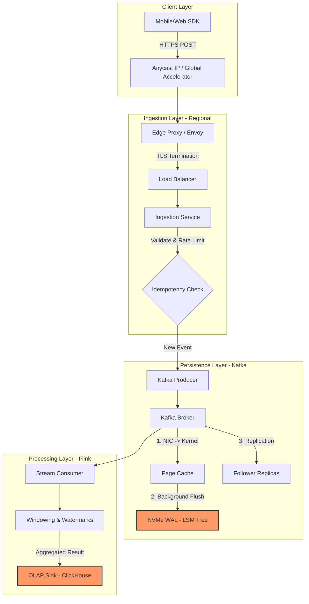
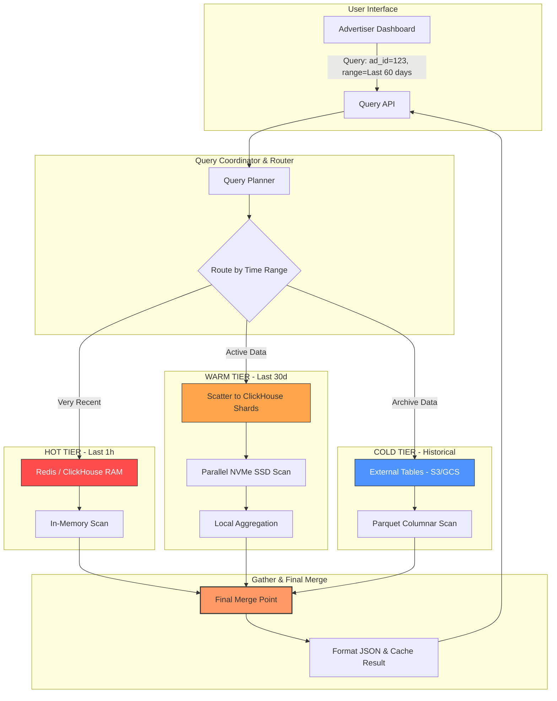

# Case Study: Ad Click Aggregator

> 🏛️ **Methodology:** This analysis is conducted using the **[Hybrid Staff Architect Framework](../FRAMEWORK.md)**. 
> It balances Product Engineering with SRE/NALSD principles to ensure physical feasibility at scale.

---

## 1. Context, Requirements & API Design

### Problem Statement
In digital advertising, tracking and aggregating user clicks is critical for billing (advertisers pay per click) and real-time campaign optimization. The challenge is to build a system that can ingest millions of raw ad-clicks per second and provide aggregated counts (e.g., clicks per ad per minute) with extremely high accuracy and low latency.

### Functional Requirements
* **Ingestion:** Capture raw click events from global users via mobile and web SDKs.
* **Aggregation:** Provide aggregated click counts per `ad_id` for specific time windows using **[Stream Windowing](../concepts/stream-windowing-watermarks.md)** (1-min, 5-min, 1-hour).
* **Querying:** Enable internal dashboards and billing systems to query aggregated results via an API.
* **Accuracy:** Ensure **[Exactly-Once](../concepts/delivery-guarantees.md#-3-exactly-once-semantics-eos)** processing semantics to prevent financial discrepancies (over-billing or under-billing).

### API Design
The system requires a high-throughput ingestion endpoint and a low-latency query endpoint.

#### 1. Ingestion API (High-scale)
* **Endpoint:** `POST /v1/clicks`
* **Description:** Used by the ad-sdk or edge proxies to report a click.

```json
{
  "ad_id": "string",
  "user_id": "string",
  "timestamp": "long (unix)",
  "ip_address": "string",
  "user_agent": "string"
}
```
#### 2. Query API (Aggregated Data)
* **Endpoint:** `GET /v1/stats?ad_id={id}&window=1m&start={t1}&end={t2}`
* **Description:** Used by dashboards to retrieve time-series click data.

```json
{
  "ad_id": "string",
  "window": "1m",
  "data": [
    {"timestamp": 1736952000, "click_count": 12500},
    {"timestamp": 1736952060, "click_count": 13200}
  ]
}
```

### Scale Assumptions & Capacity Math
Based on **[Capacity Math](../concepts/capacity-estimation-math.md)** and **[Performance Benchmarks](../concepts/infrastructure-performance-benchmarks.md)**, we define our technical boundaries:

* **Peak WPS (Writes):** 5 Million clicks / second.
* **Average WPS:** 2 Million clicks / second.
* **QPS (Reads):** 10,000 requests/second (Mostly internal dashboards and automated billing).
* **Data Payload Size:** ~500 Bytes per raw click event.
* **Throughput Requirement:**
  * $5M \times 500B = 2.5\ GB/s$ payload.
  * In terms of network: $2.5\ GB/s \times 8 \approx 20\ Gbps$ (excluding headers).
* **Daily Raw Volume (Calculation):**
  $$5 \times 10^6 \text{ clicks/sec} \times 86,400 \text{ sec/day} \times 500 \text{ bytes} \approx 216 \text{ TB / day (Raw)}$$
  This high volume necessitates a robust **[Data Tiering](../concepts/storage-tiering.md)** strategy to manage storage costs.

---

## 2. SLO, NFR & Data Modeling

### SLOs (Service Level Objectives)
* **Availability:** **99.99%** for the Ingestion API. Every click is revenue; downtime directly impacts the bottom line.
* **Latency:** * **Ingestion:** $p99 < 50ms$ to ensure mobile SDKs can "fire-and-forget" without blocking client resources.
    * **Query:** $p99 < 200ms$ for internal dashboard responsiveness.
* **Durability:** **99.999999999% (11 nines)**. Once a click is acknowledged by the ingestion layer, it must never be lost.
* **Consistency:** * **[Eventual Consistency](../concepts/cap-theorem.md#%EF%B8%8F-consistency-models-the-spectrum)** is acceptable for real-time dashboards (a few seconds of lag is expected).
    * **Strong Consistency** is required for the final daily billing settlement and financial reporting.

### Non-Functional Requirements (NFR)
* **Fault Tolerance:** The system must survive a zonal failure without data loss or significant performance degradation.
* **Idempotency:** The ingestion layer must support **[Idempotency](../concepts/idempotency.md)** to handle SDK/Proxy retries without double-counting clicks.
* **Scalability:** Must scale horizontally to handle 10x peak traffic during high-traffic events (e.g., Black Friday or global sports events).

### Data Modeling
To balance massive write throughput with fast analytical queries, we adopt a multi-layered storage strategy.

#### 1. Message Bus (Hot Layer)
* **Technology:** **[Kafka](../concepts/backpressure-flow-control.md)** or similar distributed log.
* **Partition Key:** `ad_id` (Ensures all clicks for the same ad are processed by the same consumer for local state aggregation).
* **Retention:** 7 days for replayability.

#### 2. Serving Layer (OLAP)
* **Technology:** ClickHouse or Druid (Optimized for **[LSM-Trees](../concepts/storage-lsm-trees.md)** and high-speed columnar scans).
* **Schema (Aggregated Table):**

| Column | Type | Description |
| :--- | :--- | :--- |
| `ad_id` | `String` | Partition Key / Primary Key |
| `window_start` | `Timestamp` | Start of the **[Stream Window](../concepts/stream-windowing-watermarks.md)** (1m/5m) |
| `click_count` | `UInt64` | Total number of clicks in the window |
| `unique_users` | `HyperLogLog` | Probabilistic cardinality for unique user estimation |

#### 3. Deep Archive (Cold Layer)
* **Technology:** **[Blob Storage (S3/GCS)](../concepts/storage-tiering.md)**.
* **Format:** Columnar Parquet/Avro for cost-efficient batch reconciliation and historical audits.

### Trade-off: CAP Theorem
We prioritize **Availability** and **Partition Tolerance (AP)** for the ingestion path. Rejecting a click due to a consistency check results in direct revenue loss. We bridge the gap to **Strong Consistency** via background reconciliation and a batch processing layer for final billing.

---

## 3. NALSD Capacity Planning (The Math - RF=1)

In this phase, we calculate the theoretical minimum hardware required to sustain the peak load of **5M Clicks/Sec**. We assume a raw setup (Replication Factor = 1) to establish our "Hardware Floor."

### 1. Network Math & MTU Efficiency
* **Payload Throughput:** $5M \text{ events/sec} \times 500 \text{ bytes} \approx 2.5 \text{ GB/s}$.
* **In bits:** $2.5 \text{ GB/s} \times 8 = 20 \text{ Gbps}$.
* **MTU & Packet Efficiency:**
    * Standard MTU = 1500 Bytes.
    * Click Payload = 500 Bytes (+ ~60 bytes for TCP/IP headers).
    * **Optimization:** By batching **3 clicks into a single 1500-byte Ethernet frame**, we maximize the payload-to-header ratio.
* **Hardware Choice:** Modern **100 Gbps NICs** (effective ~80 Gbps). A single 100G NIC handles this easily, even with replication overhead.

### 2. PPS Math (The Kernel Wall)
* **Raw PPS:** At 5M clicks/sec, if each click is 1 packet, we face **5M PPS**.
* **Optimized PPS (via Batching):** By utilizing the MTU efficiency (3 clicks/packet), we reduce the load to $\approx \mathbf{1.67M \text{ PPS}}$.
* **The Impact:** This brings the interrupt load below the **2M PPS per Core** limit of the standard Linux Kernel. A single core can now handle the network stack, preventing CPU saturation before the application even processes the JSON.
* **Further Gains:** Using **[XDP/eBPF](../concepts/infrastructure-performance-benchmarks.md)** could further offload this to the NIC level.

### 3. Compute Math (Core Budget & Fleet Sizing)
Ingestion involves JSON Parsing, Validation, and Schema Checks, which we categorize as **Medium Load**.

* **Logic Requirement:** Based on our **[Performance Benchmarks](../concepts/infrastructure-performance-benchmarks.md)** (~250K QPS/Core), we need $5M / 250K = \mathbf{20 \text{ Cores}}$.
* **System Overhead:** Adding 20% for OS/Kernel (Interrupts/SoftIRQs) and 10% for Runtime/GC = $\mathbf{26 \text{ Cores total theoretical}}$.
* **The "Real World" Buffer:** To handle unexpected spikes and background tasks, we target **60% CPU Utilization**.
    * $26 \text{ Cores} / 0.6 \approx \mathbf{44 \text{ Cores required fleet-wide}}$.

#### Fleet Sizing:
We use a **Standard Server Unit** of **32 Cores** (equivalent to an AWS `c7g.8xlarge`).
* **Node Count Calculation:** $44 \text{ Cores} / 32 \text{ Cores per node} \approx \mathbf{1.37 \text{ Nodes}}$.
* **High Availability (N+1) Requirement:** To ensure the system survives the loss of a single node during peak traffic:
    * **Final Fleet Size:** **3 Nodes** (Total 96 Cores). 
    * This gives us a massive safety margin and keeps each node at a healthy **~45% utilization** during normal peak, allowing for seamless failover.

### 4. Storage Math (IOPS vs. Throughput)
* **Throughput:** $2.5 \text{ GB/s}$ sequential write.
* **Benchmark:** Single NVMe Gen5 SSD provides ~6 GB/s. 
* **The IOPS Trap:** 5M random writes/sec would exceed the IOPS capacity of any single drive.
* **Strategy:** Data must be serialized using **[LSM-Trees](../concepts/storage-lsm-trees.md)** (as found in Kafka or ClickHouse) to ensure all writes hit the disk as high-speed sequential appends.

### 5. Memory Math (RAM)
* **Aggregation Buffer:** To hold a 1-minute window: $5M \text{ clicks/sec} \times 60 \text{ sec} \times 64 \text{ bytes (compact metadata)} \approx 19.2 \text{ GB}$.
* **Node Total:** We need at least **128 GB RAM** to account for Kafka/Process heap, Page Cache, and OS overhead.

### 6. Node Count Prediction (Theoretical Floor)
* **Physical Spec:** A single modern server with **64 Cores, 128GB RAM, and a 100G NIC**.
* **Result:** Technically, **1 Node** could handle the 5M PPS and 2.5 GB/s load at RF=1. However, this configuration is a **Single Point of Failure (SPOF)**.

---

## 4. Iterative Design & Bottleneck Analysis

In this phase, we move from theoretical hardware units to a resilient, distributed architecture.

### Iteration 1: The Local Bottleneck (Single Site Failures)
* **The Constraint:** Even with our 3-node cluster, a single Availability Zone (AZ) failure or a **[Load Balancer](../concepts/load-balancing.md)** misconfiguration would take the entire system offline.
* **The Bottleneck:** **Network Ingress & PPS.** While a 100G NIC handles 20 Gbps, a burst in traffic + internal replication can saturate the Top-of-Rack (ToR) switches.
* **The Fix:** Distribute nodes across at least 3 Availability Zones. Use **Anycast IP** to spread the load across multiple ingress points.

### Iteration 2: Multi-AZ & Replication Factor (RF=3)
* **Redundancy:** To satisfy our 11-nines durability SLO, we implement **Replication Factor (RF=3)** using **[Kafka](../concepts/backpressure-flow-control.md)**.
* **The Math Shift (Write Amplification):**
    * **Internal Bandwidth:** $2.5 \text{ GB/s} \times 3 = \mathbf{7.5 \text{ GB/s}}$ (60 Gbps) of internal east-west traffic for replication.
    * **Storage Impact:** Our daily raw volume jumps from 216 TB to **~648 TB/day**. 
* **The Fix:** Implement **[Sharding](../concepts/sharding-partitioning.md#%EF%B8%8F-1-horizontal-partitioning-sharding)** by `ad_id`. This ensures that all clicks for a specific campaign land on the same set of brokers, making the **[Stream Windowing](../concepts/stream-windowing-watermarks.md)** aggregation highly efficient and localized.

### Iteration 3: Global Scale & The Speed of Light (RTT)
* **The Latency Problem:** Users are global. A mobile user in Singapore clicking an ad hosted in US-East will face a ~200ms Round Trip Time (RTT). Long-haul TCP connections are prone to **[Backpressure](../concepts/backpressure-flow-control.md)** and packet loss.
* **The Bottleneck:** **[Speed of Light](../concepts/infrastructure-performance-benchmarks.md#-2-storage--memory-the-latency-hierarchy)**. We cannot provide a 50ms ingestion SLO globally from a single region.
* **The Fix: Edge Ingestion & Regional Aggregation**
    1.  **Edge POPs:** Terminate SSL/TLS at the Edge to reduce the handshake RTT.
    2.  **Regional Ingestion:** Deploy regional clusters (US, EU, APAC). 
    3.  **Partial Aggregation:** Instead of sending raw clicks across oceans, aggregate them *regionally* into 1-minute buckets.
    4.  **Global Merge:** Send only the aggregated results (e.g., `ad_123: 5000 clicks`) to the central billing region. 
    * *Result:* This reduces cross-region data transfer costs by **>99%** and hides the RTT from the user.
 
> ### 💡 Staff Architect Note: Data Gravity & Physics
> The shift from **Raw Data Transfer** to **Aggregated Data Transfer** is the most critical architectural decision in this design. 
> 
> * **Respecting Physics:** By aggregating locally, we acknowledge the **[Speed of Light](../concepts/infrastructure-performance-benchmarks.md)** constraints. We move the "computation" to the data (at the Edge) rather than moving the "massive data" to a central computation point.
> * **Fiscal Responsibility:** Cross-region data transfer is one of the highest costs in cloud infrastructure. Reducing the payload from raw events (216 TB/day) to aggregated summaries (GBs/day) reduces egress costs by **>99%**.
> * **Resiliency:** Regional clusters act as "bulkheads," ensuring that a failure in the Central Billing region does not stop click ingestion globally.

---

## 5. Architecture & Path Analysis

In this phase, we move from hardware math to the logical and physical journey of data through the system.

### High-Level Architecture
The system follows a **Regional Ingestion / Global Analysis** pattern to minimize latency and maximize availability.


### The Write Path (The Journey of a Click)
Tracing a click from a user's phone to the final database record:

1. **Edge Entry:** The click hits an **[Edge Proxy](../concepts/load-balancing.md)** (Envoy/NGINX). TLS is terminated here to reduce RTT. The proxy validates the **[Idempotency](../concepts/idempotency.md)** token to prevent double-counting.
2. **Buffer (The Log):** The proxy produces the event to a **Regional [Kafka](../concepts/backpressure-flow-control.md)** cluster. 
    * *Hardware Path:* NIC -> Kernel Buffer -> App Memory -> **[LSM-Tree](../concepts/storage-lsm-trees.md)** WAL on NVMe SSD.
3. **Compute (The Aggregator):** A stream processing engine (e.g., Flink) consumes the raw events.
    * It maintains a "Hot State" in memory for the current **[Stream Window](../concepts/stream-windowing-watermarks.md)**.
    * It handles late-arriving events using **Watermarks**.
4. **Commit (The Serving Layer):** Every minute, the processor flushes the aggregated counts to an **OLAP Database** (ClickHouse). 
    * This uses **[Data Tiering](../concepts/data-tiering.md)**: Aggregated counts stay in SSDs for fast querying, while raw logs are moved to S3 for long-term audit.
  



### The Read Path (The Query Journey)
When an advertiser checks their dashboard:

1. **API Gateway:** Receives the `GET /v1/stats` request.
2. **Scatter-Gather:** The query service identifies which shards (based on `ad_id`) hold the data.
3. **Columnar Scan:** ClickHouse performs a high-speed scan of the relevant **[LSM-Tree](../concepts/storage-lsm-trees.md)** parts. Since data is stored by time, it only reads the specific blocks for the requested time range.
4. **Aggregation Merge:** If the query spans multiple shards or windows, a final merge is performed in memory before returning the result.





### Observability & Reliability
* **White-box Metrics:** We track "Consumer Lag" in Kafka. If lag increases, it’s a signal that our compute layer is under-provisioned.
* **Health Checks:** Using **[Backpressure](../concepts/backpressure-flow-control.md)** signals, the ingestion layer can tell the Load Balancer to shed traffic if the internal buffers are full.

---

## 6. Stress-Test & Vulnerability Analysis (The Grilling)

In this final phase, we stress-test our architectural assumptions against real-world chaos to ensure the system doesn't just work, but stays resilient.

### 1. The "Hot Shard" Problem (Viral Ad Event)
* **Scenario:** A global celebrity shares an ad. The specific `ad_id: "superstar_promo"` receives 1M+ clicks/sec instantly.
* **The Risk:** Since we shard by `ad_id`, all this traffic hits a single Kafka partition and a single Stream Processing node. This node will experience CPU/RAM exhaustion while the rest of the cluster sits idle.
* **Architectural Fix:** **[Salting Strategy](../concepts/sharding-partitioning.md)**. If an `ad_id` exceeds a specific throughput threshold, we append a random salt to the key (e.g., `ad_id_1`, `ad_id_2`). This spreads the load across multiple nodes. The final counts are re-aggregated during the "Gather" phase of the query.

### 2. The "Poison Pill" (Malformed Data)
* **Scenario:** A bug in an upstream SDK sends a malformed or non-JSON payload into the stream.
* **The Risk:** The Stream Processor (Flink) throws an exception and crashes while trying to deserialize the message. Upon restart, it reads the same message and crashes again, creating an infinite crash loop that halts the entire pipeline.
* **Architectural Fix:** **Dead Letter Queue (DLQ)**. We wrap the deserialization logic in a try-catch block. Any message that fails schema validation is routed to a separate "DLQ Topic" for manual inspection, allowing the main pipeline to continue processing.

### 3. Cascading Failures & Backpressure
* **Scenario:** The OLAP Storage layer (ClickHouse) experiences a slowdown due to a heavy background merge process.
* **The Risk:** The Stream Processor cannot flush data, its internal buffers fill up, and it exerts **[Backpressure](../concepts/backpressure-flow-control.md)** on Kafka. If the Ingestion API keeps accepting new clicks at 5M/s, the entire memory of the ingestion fleet will be exhausted.
* **Architectural Fix:** **Load Shedding & Circuit Breaking**. We monitor the Kafka "Consumer Lag." If the lag crosses a critical threshold, the Ingestion API begins returning `HTTP 503` (Service Unavailable) to the SDKs. This drops traffic at the door to save the core infrastructure from a total collapse.

### 4. Clock Skew & Late Arriving Data
* **Scenario:** A mobile device has its system clock set to 1970 or 2050, or a user goes into a tunnel and their clicks arrive 2 hours late.
* **The Risk:** These events can mess up time-window aggregations and "Watermark" logic, leading to inaccurate billing.
* **Architectural Fix:** **[Watermarks & Allowed Lateness](../concepts/stream-windowing-watermarks.md)**. We define a strict "Allowed Lateness" (e.g., 10 minutes). Anything arriving beyond that is logged to the Cold Tier (S3) for later batch reconciliation but excluded from real-time "Hot" counts to maintain dashboard performance.

---


## 🏆 Final Architecture Summary

| Feature | Solution | Benefit |
| :--- | :--- | :--- |
| **Ingestion** | Anycast + Edge Proxy | Global < 50ms latency |
| **Durability** | Kafka WAL (RF=3) | 11-nines data safety |
| **Throughput** | LSM-Tree (Sequential I/O) | 2.5 GB/s sustained writes |
| **Cost** | Hot/Warm/Cold Tiering | >90% savings on storage |
| **Accuracy** | Idempotency + Bloom Filters | Prevents double-billing |

---
