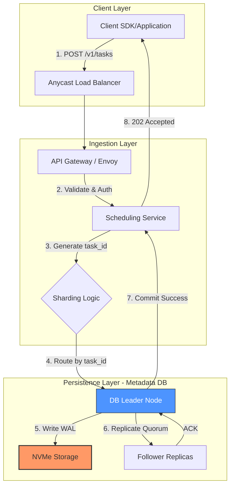
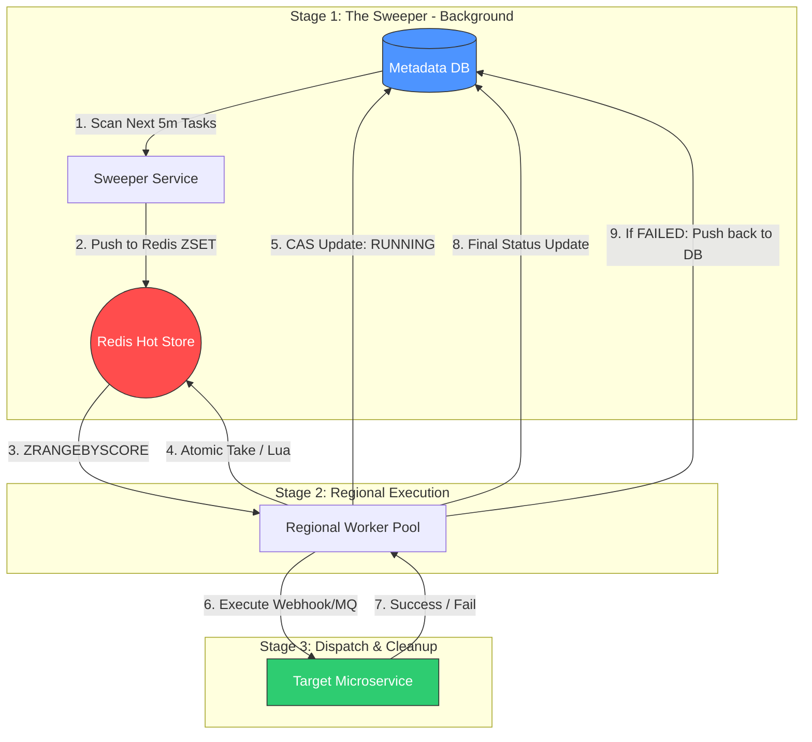

# 🕰️ Case Study: Distributed Task Scheduler

> 🏛️ **Methodology:** This analysis is conducted using the **[Hybrid Staff Architect Framework](../FRAMEWORK.md)**. 
> It balances Product Engineering with SRE/NALSD principles to ensure physical feasibility at scale.

---

## 1. Context, Requirements & API Design

### Problem Statement
In a microservices ecosystem, many business processes are time-dependent (e.g., sending a reminder email 24h after signup, expiring a checkout session in 15 mins, or daily billing). A **Distributed Task Scheduler** serves as a centralized service that accepts task definitions and guarantees their execution at a precise future timestamp across a distributed fleet of workers.

### Functional Requirements
* **Scheduling:** Support one-time (timestamp) and recurring (Cron) task scheduling.
* **Execution:** Trigger tasks with a user-defined payload (usually via Webhook or Message Queue).
* **Reliability:** Guarantee **[At-Least-Once](../concepts/delivery-guarantees.md)** execution. A task must never be forgotten.
* **Management:** CRUD operations for tasks (cancel a reminder if the user takes action early).
* **Multi-tenancy:** Isolation between different internal services to prevent one service's burst from delaying another's tasks.

### API Design
The system requires high-throughput scheduling and a highly available management interface.

#### 1. Task Scheduling API
* **Endpoint:** `POST /v1/tasks`
* **Description:** Schedules a new task.

```json
{
  "task_type": "WEBHOOK",
  "scheduled_at": 1736952000,
  "payload": {
    "url": "[https://email-service.internal/send](https://email-service.internal/send)",
    "method": "POST",
    "body": "{\"user_id\": \"abc\", \"template\": \"reminder\"}"
  },
  "retry_policy": {
    "max_retries": 3,
    "backoff": "exponential"
  }
}
```

#### 2. Get Task Status API
* **Endpoint:** `GET /v1/tasks/{task_id}`
* **Description:** Retrieves the current state and execution history of a specific task.

```json
{
  "task_id": "uuid-v4",
  "status": "PENDING",
  "scheduled_at": 1736952000,
  "retry_count": 0,
  "last_error": null,
  "created_at": 1736940000,
  "updated_at": 1736940000
}
```

#### 3. Cancel Task API
* **Endpoint:** `DELETE /v1/tasks/{task_id}`
* **Description:** Cancels a scheduled task.

**Example Response (Success - 200 OK):**
```json
{
  "task_id": "550e8400-e29b-41d4-a716-446655440000",
  "status": "CANCELED",
  "message": "Task successfully removed from the schedule.",
  "canceled_at": 1736951000
}
```

**Example Response (Conflict - 409 Conflict):**
```json
{
  "error_code": "TASK_ALREADY_RUNNING",
  "message": "Cannot cancel task because it is already in RUNNING state.",
  "task_id": "550e8400-e29b-41d4-a716-446655440000"
}
```

**Example Response (Not Found - 404 Not Found):**
```json
{
  "error_code": "TASK_NOT_FOUND",
  "message": "The requested task_id does not exist in our records.",
  "task_id": "550e8400-e29b-41d4-a716-446655440000"
}
```

### Scale Assumptions & Capacity Math
Based on **[Capacity Math](../concepts/capacity-estimation-math.md)** and **[Performance Benchmarks](../concepts/infrastructure-performance-benchmarks.md)**, we define the operational boundaries for a Tier-0 Distributed Scheduler:

* **Total Tasks:** 10 Billion tasks / month.
* **WPS (Write Per Second - Scheduling):**
    * Average: $10B / 2.59M \text{ seconds} \approx 3,860 \text{ WPS}$.
    * Peak: **20,000 WPS** (Assuming marketing campaigns or high-traffic event bursts).
* **QPS (Read/Execution Per Second):**
    * Peak: **50,000 QPS**. (Triggering bursts occur at the top of the hour or during system-wide cron jobs).
* **Data Payload Size:** ~1 KB per task (Metadata + Headers + Body).
* **Throughput Requirement:**
    * Ingress: $20,000 \text{ WPS} \times 1 KB = 20 \text{ MB/s}$.
    * Egress (Execution): $50,000 \text{ QPS} \times 1 KB = 50 \text{ MB/s}$.
    * Total Network: $70 \text{ MB/s} \times 8 \approx 0.56 \text{ Gbps}$ (Safe for 10G/100G NICs).
* **Storage Volume (90-day retention):**
    * Calculation: $30B \text{ tasks} \times 1 KB = 30 \text{ TB (Raw)}$.
    * With **RF=3** for high durability: $30 \text{ TB} \times 3 = \mathbf{90 \text{ TB}}$.
* **IOPS Demand:**
    * Peak writes are 20,000/sec. With metadata indexing and WAL updates, we expect ~60,000 Disk IOPS.
    * **Staff Insight:** Standard NVMe drives handle 500K+ IOPS, but we must use **[LSM-Trees](../concepts/storage-lsm-trees.md)** to ensure these writes are sequential appends to avoid random I/O bottlenecks.

---


## 2. SLO, NFR & Data Modeling

### SLOs (Service Level Objectives)
* **Availability:** **99.99% (Four Nines)**. Scheduling is a Tier-0 dependency; downtime blocks other services from executing time-critical business logic.
* **Execution Precision:** **p99 < 1s**. The delay between the target `scheduled_at` time and the actual trigger must be sub-second for most tasks.
* **Durability:** **99.999999999% (11 nines)**. Once a task is accepted (202 Accepted), it must be persisted across multiple availability zones. Task loss is unacceptable.
* **Throughput:** System must handle up to **50,000 triggers per second** without degrading precision.

### Non-Functional Requirements (NFR)
* **[At-Least-Once Delivery](../concepts/delivery-guarantees.md):** The core guarantee of the system. Tasks must be retried upon worker or network failure until a terminal state (Success or Max Retries) is reached.
* **Horizontal Scalability:** Ability to scale the API (Scheduling) and the Execution Fleet independently to handle 10x spikes.
* **[Idempotency](../concepts/idempotency.md):** Since we guarantee at-least-once delivery, downstream consumers **must** be idempotent to handle potential duplicate triggers during network partitions.
* **Multi-tenancy:** Resource isolation and fair-share scheduling to prevent "Noisy Neighbor" effects between internal services.

### Data Modeling
A scheduler's performance is bound by its ability to efficiently find "due" tasks. Scanning a multi-terabyte table every second is physically impossible without a tiered storage strategy.

#### 1. Task Metadata Store (The Source of Truth)
* **Technology:** **NewSQL (e.g., CockroachDB)** or **Partitioned PostgreSQL**.
* **Rationale:** We need **[ACID Transactions](../concepts/acid-vs-base.md)** for status transitions (e.g., moving a task from `PENDING` to `RUNNING`) to ensure no two nodes pick up the same task simultaneously.
* **Partitioning:** Hash Partitioning by `task_id` for management (CRUD) and List Partitioning by `scheduled_at` for efficient archiving/TTL.

| Column | Type | Indexing Strategy |
| :--- | :--- | :--- |
| `task_id` | `UUID` | Primary Key |
| `tenant_id` | `UUID` | GSI (Global Secondary Index) |
| `scheduled_at` | `Timestamp` | B-Tree (The main scan path) |
| `status` | `Enum` | Partial Index (where status = `PENDING`) |
| `payload` | `JSONB` | No Index |
| `version` | `Int` | Used for **[Optimistic Locking](../concepts/locking-strategies.md)** |

#### 2. The Execution Buffer (The Hot Path)
* **Technology:** **Redis Sorted Sets (ZSET)**.
* **Mechanism:** A "Sweeper" service identifies tasks due in the next $T$ minutes and pushes them to Redis.
* **Key:** `scheduler:tasks:due` | **Score:** `scheduled_at` (Unix Timestamp).
* **Optimization:** This shifts the heavy lifting from high-latency Disk I/O to low-latency Memory, allowing us to query "Which tasks are due now?" in $O(\log N)$ time.

---

## 3. NALSD Capacity Planning (The Physics - RF=1)

In this phase, we establish the "Hardware Floor" by calculating the theoretical minimum resources required to handle the peak load of **20,000 WPS (Scheduling)** and **50,000 QPS (Triggering)**.

### 1. Network Math & MTU Efficiency
* **Ingress (Scheduling):** $20,000 \text{ WPS} \times 1 \text{ KB/task} \approx 20 \text{ MB/s}$.
* **Egress (Execution):** $50,000 \text{ QPS} \times 1 \text{ KB/task} \approx 50 \text{ MB/s}$.
* **Total Throughput:** $70 \text{ MB/s} \approx 0.56 \text{ Gbps}$.
* **Analysis:** A standard **10 Gbps NIC** handles this with only **5.6% utilization**. Bandwidth is not the bottleneck.

### 2. PPS Math (The Kernel Wall)
* **Total Transactions:** 70,000 requests/sec.
* **Estimated PPS:** Assuming 2 packets per request (Request + ACK/Response) = **140,000 PPS**.
* **Limit:** Standard Linux Kernel handles **~2M PPS per Core**.
* **Analysis:** Our load is well within the limits of the standard network stack. **[XDP/eBPF](../concepts/infrastructure-performance-benchmarks.md)** is not required for this volume.

### 3. Compute Math (Core Budget)
We categorize our tasks based on their CPU intensity:
* **API Layer (Medium Load):** JSON Parsing + Auth + Validation. 
    * Benchmark: 250K QPS/Core.
    * Requirement: $20,000 / 250,000 \approx \mathbf{0.08 \text{ Cores}}$.
* **Execution Engine (Heavy Load):** Webhook triggers + TLS Handshakes + Retry Logic.
    * Benchmark: 50K QPS/Core (due to heavy I/O wait and encryption).
    * Requirement: $50,000 / 50,000 = \mathbf{1.0 \text{ Core}}$.
* **Total Raw Cores:** $\approx 1.1 \text{ Cores}$.
* **Staff Buffer:** To handle background tasks (Compaction, DB Sweeping) and stay at **60% utilization**, we need $\approx \mathbf{2 \text{ Cores fleet-wide}}$.

### 4. Storage Math (IOPS vs. Throughput)
* **Throughput:** 70 MB/s (Sequential write to WAL and Sorted Sets).
* **IOPS (The Danger Zone):**
    * 20,000 new tasks/sec = 20,000 Random Writes.
    * Updating status to `RUNNING` and then `COMPLETED` for 50,000 tasks/sec = 100,000 Random Updates.
    * **Total IOPS Demand:** $\approx \mathbf{120,000 \text{ IOPS}}$.
* **Hardware Choice:** Single NVMe SSD handles **500K Random IOPS**.
* **Analysis:** While a single NVMe can handle this, the database must use **[LSM-Trees](../concepts/storage-lsm-trees.md)** to convert these random updates into sequential appends to prevent high disk latency.

### 5. Memory Math (RAM)
* **Hot Window (Redis):** Keeping tasks for the next 10 minutes in memory.
    * $50,000 \text{ tasks/sec} \times 600 \text{ sec} \times 1 \text{ KB} = \mathbf{30 \text{ GB}}$.
* **Metadata Cache:** $10 \text{ GB}$.
* **OS & Buffer:** $4 \text{ GB}$.
* **Total RAM:** $\mathbf{44 \text{ GB required}}$.

### 6. Node Count Prediction (The Theoretical Floor)
* **Physical Spec:** A modern 8-Core, 64GB RAM machine with an NVMe drive.
* **Result:** Technically, **1 Node** can handle the entire raw load at RF=1. However, to satisfy our **99.99% Availability SLO**, we must transition to a distributed cluster.

---

## 4. Iterative Design & Bottleneck Analysis

In this phase, we move from a theoretical single-node setup to a resilient, globally scalable architecture, identifying where the "physics" of the hardware meets the "chaos" of distributed systems.

### Iteration 1: The Single-Node Breaking Point
* **The Constraint:** Our Step 3 math showed that 120,000 IOPS and 50,000 QPS are technically possible on one high-end NVMe server.
* **The Bottleneck:** **The "Locking" Wall.** Even with Optimistic Locking, thousands of threads fighting for the same database pages or Redis Sorted Sets create **[Lock Contention](../concepts/locking-strategies.md)**.
* **Proof:** As PPS increases beyond 140K, context switching between Kernel and User space (SoftIRQs) starts consuming >30% of CPU cycles, reducing the budget for actual task processing.
* **The Fix:** **[Sharding](../concepts/sharding-partitioning.md)**. We must split the "Hot Path" (Redis) and the Metadata Store into multiple independent shards based on `task_id` or `tenant_id`.

### Iteration 2: Replication & High Availability (RF=3)
* **The Requirement:** To meet our **11-nines Durability** SLO, we cannot rely on a single disk.
* **The Math Shift (Write Amplification):**
    * **Network:** $0.56 \text{ Gbps} \times 3 \text{ (Replication)} = \mathbf{1.68 \text{ Gbps}}$. Still safe on a 10G NIC.
    * **Storage:** 30 TB raw data becomes **90 TB** across the fleet.
* **The Bottleneck:** **Replication Lag.** During a burst of 50,000 triggers/sec, if the follower replicas fall behind, a leader failure could result in "lost" tasks or "double-triggered" tasks upon failover.
* **The Fix:** Use **[Quorum Writes (R+W > N)](../concepts/consistency-levels.md)**. Ensure a task is committed to at least 2 out of 3 nodes before returning `202 Accepted` to the client.


### Iteration 3: Global Execution & The Speed of Light
* **The Problem:** A task scheduled by a user in New York might need to trigger a webhook for a service in Tokyo.
* **The Constraint:** **[Speed of Light (RTT)](../concepts/infrastructure-performance-benchmarks.md)**. The RTT between NYC and Tokyo is ~200ms. If our scheduler is only in US-East, we lose 20% of our 1s "Execution Precision" SLO just in network transit.
* **The Bottleneck:** **Cross-Region Latency.** Managing a single global database for billions of tasks creates massive latency for remote users.
* **The Fix: Regional "Pullers" with Global Metadata.**
    1. Keep the Source of Truth (Metadata) in a globally distributed DB (e.g., CockroachDB).
    2. Deploy **Regional Execution Clusters** (Workers) that only pull tasks meant for their specific region.
    3. Use a **Fencing Token** strategy to ensure that even if a regional cluster is partitioned, it doesn't double-trigger tasks when it reconnects.

> ### 💡 Staff Architect Note: The "Thundering Herd" Problem
> Most scheduled tasks are set for "clean" times (e.g., exactly at 09:00:00). This creates massive spikes at the start of every minute/hour. 
> 
> * **Strategy:** We must implement **Jitter** in our internal polling logic and **[Backpressure](../concepts/backpressure-flow-control.md)** at the execution layer. If our workers are overwhelmed, we prefer a slight delay in execution over a total system collapse due to memory exhaustion.

---

## 5. Architecture & Path Analysis (The Deep Dive)

In this phase, we map the logical flow of data to the physical infrastructure, ensuring our **p99 < 1s Execution Precision** and **11-nines Durability** goals are met.

### High-Level Architecture
The system uses a **Shard-per-Tenant** and **Regional Poller** model to ensure isolation and low latency.

---

### 📥 The Write Path: Scheduling a Task
When a user calls `POST /v1/tasks`, the data travels as follows:

1. **Ingress:** Request hits the **Load Balancer (L7)** and is routed to a `Scheduling Service` instance.
2. **Validation:** Service checks auth and validates the payload/cron expression.
3. **Quorum Commit:** * The service generates a `task_id` and writes the record to the **Metadata Store (DB)**.
    * **[Quorum Write (W=2, N=3)](../concepts/consistency-levels.md):** The DB leader replicates the WAL (Write Ahead Log) to at least one follower synchronously.
    * *Hardware Path:* NIC -> Kernel Space -> App Memory -> DB Buffer -> **[NVMe WAL (Sequential Append)](../concepts/storage-lsm-trees.md)**.
4. **Acknowledgment:** Once the quorum is reached, the user receives `202 Accepted`.


### 📥 The Write Path: Scheduling a Task (Deep Dive)
Tracing the journey from a client's request to a durable quorum commit.




### 🚀 The Execution Path: Triggering a Task
Precision is achieved through a two-stage polling mechanism:

1. **The Sweeper (L1 Cache Filling):**
    * A background process scans the DB for tasks where `scheduled_at` is in the next 5 minutes.
    * It pushes these tasks into **Redis Sorted Sets (ZSET)**.
    * *Why?* To avoid high-latency disk scans during the critical execution second.
2. **The Poller (The Trigger):**
    * Regional workers poll Redis using `ZRANGEBYSCORE` for tasks where `score <= NOW()`.
    * **Atomic Take:** Workers use a Lua script or `WATCH` command (Optimistic Locking) to claim a task, moving it from `PENDING` to `RUNNING` in the DB.
3. **Dispatcher:** The worker executes the webhook or pushes to a message queue.
4. **Finalize:** Upon success, the task is marked `COMPLETED` in the DB (or `FAILED` for retry).



### 🛠️ Background & Async Paths
* **Retry Engine:** If a task fails, the `Retry Handler` calculates the next backoff time and re-inserts the task into the Metadata Store.
* **Archiver:** A daily job moves `COMPLETED/CANCELED` tasks older than 30 days from the "Hot" DB partitions to **[Cold Storage (S3/GCS)](../concepts/storage-tiering.md)** as Parquet files.

---

### 📊 Observability & Reliability
* **Execution Lag:** Metric measuring `Actual_Trigger_Time - Scheduled_Time`. This is our most critical SLO monitor.
* **Sweeper Health:** Monitor if the Redis ZSET is being populated correctly. If the sweeper dies, execution stops.
* **[Backpressure](../concepts/backpressure-flow-control.md):** If the execution fleet's p99 latency rises, the API layer starts rate-limiting new task creation to protect the Metadata Store.
* **Dead Letter Queue (DLQ):** Tasks that exhaust all retries are moved to a DLQ for manual inspection/recovery.

---

## 6. Stress-Test & Vulnerability Analysis (The Grilling)

In this final phase, we subject our architecture to "The Grilling"—testing how it handles edge cases that typically crash production systems.

### 1. The "Top of the Hour" Thundering Herd
* **Scenario:** Millions of tasks are scheduled exactly for `09:00:00 UTC`.
* **The Risk:** At exactly 09:00:00, every regional worker pool issues a `ZRANGEBYSCORE` and then thousands of concurrent `UPDATE` commands to the Metadata DB. This leads to **[Lock Contention](../concepts/locking-strategies.md)** and potential DB exhaustion.
* **Architectural Fix:** * **Jitter:** Introduce a random delay (e.g., 0-500ms) at the worker level.
    * **Rate Limiting:** Implement execution-side **[Backpressure](../concepts/backpressure-flow-control.md)** to ensure we don't exceed the target service's capacity or our own DB's IOPS.

### 2. The "Hot Shard" Tenant
* **Scenario:** A single massive tenant (e.g., a huge marketing platform) schedules 80% of the total 10B tasks.
* **The Risk:** If we shard purely by `tenant_id`, one DB/Redis node becomes a hotspot while others sit idle.
* **Architectural Fix:** **Compound Sharding**. Shard by `tenant_id + task_id`. This ensures that even for a single large tenant, tasks are distributed uniformly across the entire persistence fleet.

### 3. Clock Skew & The Time-Machine Bug
* **Scenario:** One worker node has a system clock that drifts 5 seconds ahead of the cluster.
* **The Risk:** This node might "steal" and trigger tasks prematurely, violating the business logic that requires a task to run *at or after* the scheduled time.
* **Architectural Fix:** * **NTP/PTP Monitoring:** Use Amazon Time Sync or Google Public NTP with strict alerting on drift > 100ms.
    * **DB-Driven Time:** Use `NOW()` from the Metadata Store (the central source of truth) as the reference time for the Sweeper, rather than the local system clock.

### 4. The "Poison Pill" Payload
* **Scenario:** A task is scheduled with a payload that causes the worker to crash (e.g., a buffer overflow exploit or a malformed JSON that triggers an unhandled exception).
* **The Risk:** The worker crashes, the task is never marked `COMPLETED`, the Sweeper picks it up again, it's sent to another worker, which also crashes. This creates a **Recursive Crash Loop**.
* **Architectural Fix:** **Visibility Timeout & Max Retries**. Every time a task is picked up, increment an `attempt_count` in Redis/DB. If a task exceeds 5 attempts without success, move it to a **[Dead Letter Queue (DLQ)](../concepts/dead-letter-queues.md)** and alert an engineer.

### 5. Zombie Leaders (Network Partition)
* **Scenario:** A network partition splits the Metadata DB. Two nodes think they are the leader (Split-brain).
* **The Risk:** Both leaders might allow workers to trigger the same set of tasks, leading to double-billing or duplicate emails.
* **Architectural Fix:** **[Fencing Tokens](../concepts/consistency-levels.md)**. Use a monotonically increasing version number (Term) from the consensus layer (Raft/Paxos). Any write or trigger attempt with an old term is rejected by the storage nodes.

---

## 🏆 Final Architecture Summary

| Feature | Solution | Benefit |
| :--- | :--- | :--- |
| **Persistence** | CockroachDB / NewSQL (CP) | 11-nines durability & Strong Consistency |
| **Hot Path** | Redis ZSET (In-Memory) | $O(\log N)$ scan time for due tasks |
| **Scalability** | Sharding by `tenant_id + task_id` | No Hot Shards; Linear horizontal scaling |
| **Reliability** | Quorum Writes (W=2, N=3) | Survives Zonal Failures without data loss |
| **Precision** | Regional Poller Fleet | Sub-second (p99 < 1s) execution precision |

---
